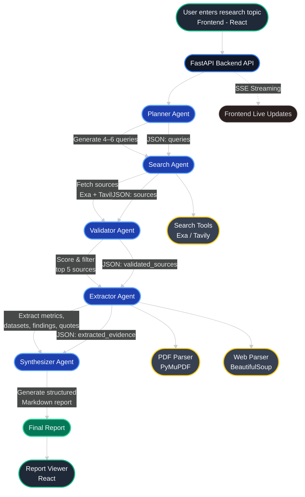

# Multi-Agent Research Citation Engine

A production-grade AI research assistant built with **CrewAI** (Python) and a **React + Vite** frontend.  
Enter any research topic and receive a structured Markdown report with accurate citations, extracted evidence, and verified references — similar to Perplexity Deep Research or Elicit, but fully open and customisable.

---

## What It Does

1. **Planner Agent** decomposes your topic into 4–6 targeted search queries
2. **Search Agent** retrieves up to 8 sources per query from arXiv, IEEE, ACL, GitHub, and official docs via Exa and Tavily APIs
3. **Validator Agent** scores every source (1–10) on credibility, recency, and technical depth — keeps only the top 5
4. **Extractor Agent** fetches each source (PDF or webpage), chunks the text, and extracts metrics, datasets, findings, and verbatim quotes
5. **Synthesizer Agent** merges all evidence into a structured Markdown report with inline citations — no hallucination, every claim is grounded

---

## Architecture



All agents communicate via **structured JSON only** — never raw documents.  
The FastAPI backend streams agent progress to the React frontend via **Server-Sent Events (SSE)**.

---

## Tech Stack

| Layer | Technology |
|---|---|
| Backend API | FastAPI + Uvicorn |
| AI Agents | CrewAI (sequential pipeline) |
| LLM | OpenAI GPT-4o **or** HuggingFace Inference API |
| Search | Exa neural search (primary) + Tavily (fallback) |
| PDF parsing | PyMuPDF (`fitz`) |
| Web parsing | BeautifulSoup4 |
| Frontend | React 18 + Vite + TypeScript |
| UI | shadcn/ui + Tailwind CSS |
| Streaming | Server-Sent Events (SSE) |
| Deployment | Render (backend web service + static frontend) |

---

## Quick Start

### 1. Clone & install

```bash
git clone <repo-url>
cd multi-agent-researcher-2

# Backend
python -m venv .venv && source .venv/bin/activate
pip install -r backend/requirements.txt

# Frontend
cd frontend && npm install
```

### 2. Configure environment

```bash
cp "env (1).example" .env
# Edit .env and fill in your keys
```

### 3. Run locally

```bash
# Terminal 1 — Backend (from repo root)
cd backend
uvicorn app:app --reload --port 8000

# Terminal 2 — Frontend
cd frontend
npm run dev
```

Open [http://localhost:8080](http://localhost:8080) — the Vite dev server proxies `/api/*` to the FastAPI backend automatically.

---

## Project Structure

```
multi-agent-researcher-2/
├── backend/
│   ├── agents/
│   │   ├── planner_agent.py       # Research Strategist
│   │   ├── search_agent.py        # Academic Source Finder
│   │   ├── validator_agent.py     # Source Quality Evaluator
│   │   ├── extractor_agent.py     # Technical Evidence Extractor
│   │   └── synthesizer_agent.py   # Research Writer
│   ├── tasks/
│   │   ├── planning_task.py       # Query decomposition task
│   │   ├── search_task.py         # Source retrieval task
│   │   ├── validation_task.py     # Source scoring & filtering task
│   │   ├── extraction_task.py     # Evidence extraction task
│   │   └── summary_task.py        # Final report generation task
│   ├── tools/
│   │   ├── search_tool.py         # Exa + Tavily search tools
│   │   ├── pdf_extractor.py       # PyMuPDF PDF text extractor
│   │   └── web_parser.py          # BeautifulSoup webpage parser
│   ├── utils/
│   │   ├── token_utils.py         # count_tokens, truncate_text
│   │   └── text_chunker.py        # chunk_text with overlap
│   ├── app.py                     # FastAPI server with SSE streaming
│   ├── main.py                    # Pipeline runner & CLI entry point
│   └── requirements.txt
├── frontend/
│   ├── src/
│   │   ├── api/client.ts          # REST API client
│   │   ├── hooks/
│   │   │   ├── useJobStream.ts    # SSE event consumer
│   │   │   └── useElapsedTime.ts  # Timer hook
│   │   ├── pages/
│   │   │   ├── Index.tsx          # Home / topic input page
│   │   │   └── ResearchPage.tsx   # Live pipeline + report view
│   │   └── components/
│   │       ├── PipelineSidebar.tsx # Agent status sidebar
│   │       └── ReportViewer.tsx    # Markdown report renderer
│   ├── package.json
│   └── vite.config.ts
├── render.yaml                    # Render deployment config
└── README.md
```

---


## Token Safety

The system enforces strict limits at every layer:

| Layer | Limit | Mechanism |
|---|---|---|
| Document download | 10 MB | Streaming cap in `pdf_extractor.py` |
| Extracted text per source | 3 000 chars | Hard truncation in tools |
| Text chunks | 800 tokens | `chunk_text()` in `text_chunker.py` |
| Evidence per source | 300 tokens | Agent instruction + task constraint |
| LLM calls | Retried on 429 | `tenacity` exponential backoff |

---

## Output Format

```markdown
# Research Summary: <Topic>

## Key Insights

1. **<Headline>**
   <Supporting evidence, 2–4 sentences.>
   *Source: [1]*

## Methodology Overview
<Concise description drawn from extracted methodology snippets.>

## Benchmarks & Metrics
| Metric | Value | Source |
|--------|-------|--------|
| ...    | ...   | [1]    |

## Sources

[1] <Title>
    <URL>
```

---

## Extending the System

| Goal | Where to change |
|---|---|
| Add a new search backend | `tools/search_tool.py` — create a new `BaseTool` subclass |
| Change number of top sources | `tasks/validation_task.py` — update the "keep TOP N" instruction |
| Support local LLMs (Ollama) | `main.py` `_build_llm()` — swap `LLM(model="ollama/...")` |
| Add memory across sessions | `main.py` Crew constructor — set `memory=True` and configure a vector store |
| Export to PDF | Post-process `research_report.md` with `pandoc` or `weasyprint` |
| Add a new agent | Create agent + task files, wire into `main.py` pipeline |

---

## Requirements

- Python ≥ 3.10
- Node.js ≥ 18
- OpenAI API key **or** HuggingFace token
- Exa API key (free tier at [exa.ai](https://exa.ai))
- Tavily API key (optional, free tier at [tavily.com](https://tavily.com))